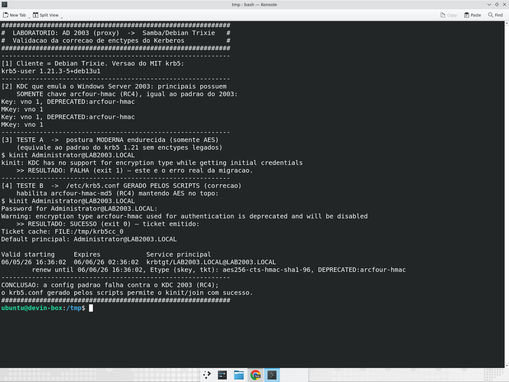

# Laboratório-proxy de Kerberos (AD 2003 → Samba/Debian Trixie)

Valida, **sem um Windows Server 2003 real**, que a correção de enctypes do Kerberos
(habilitar RC4/legados no `/etc/krb5.conf`) resolve o erro
`KDC has no support for encryption type` ao autenticar contra um KDC que só oferece
os enctypes legados do 2003.

## Por que é um "proxy"
Não é possível executar um Windows Server 2003 real (SO proprietário,
descontinuado, sem ISO/licença). O laboratório reproduz fielmente a **negociação
de enctypes**, que é a causa-raiz do problema:

- **Cliente:** container **Debian Trixie** com **MIT krb5 1.21.3** (versão alvo).
- **KDC "2003":** MIT KDC cujos principais (`krbtgt` e `Administrator`) possuem
  **somente chave `arcfour-hmac` (RC4)** — o padrão do Windows 2003 — com
  `allow_rc4 = true` para emitir tickets RC4 como um DC 2003 faz.

## Resultado: PASSOU

| Cenário | Config do cliente | Resultado |
|---|---|---|
| A | Postura moderna endurecida (somente AES) | `kinit` **FALHA**: `KDC has no support for encryption type` (exit 1) |
| B | `/etc/krb5.conf` **gerado pelos scripts** (habilita `arcfour-hmac-md5`, AES no topo) | `kinit` **SUCESSO** (exit 0): TGT emitido |

O Teste A reproduz o erro real da migração; o Teste B prova que a correção dos
scripts permite a autenticação contra o KDC legado.

### Evidência



Trecho-chave do ticket obtido no Teste B (ver `transcript.txt`):
```
Etype (skey, tkt): aes256-cts-hmac-sha1-96, DEPRECATED:arcfour-hmac
```

## Descoberta importante (krb5 1.21 / Trixie)
O krb5 1.21 reporta, ao ler o `krb5.conf` dos scripts:
```
Unrecognized enctype name in default_tkt_enctypes: des-cbc-md5
Unrecognized enctype name in default_tkt_enctypes: des-cbc-crc
```
No Debian Trixie o **DES foi removido por completo** — esses enctypes são
**ignorados**. O único enctype legado que ainda funciona é o **RC4
(`arcfour-hmac-md5`)**, e mesmo assim com aviso de depreciação.

**Implicação prática:**
- AD 2003 padrão (**RC4**, caso típico): a correção **funciona**.
- DC raro **DES-only** (2000/2003 antigo): **nem a correção resolve no Trixie**,
  pois o DES não existe mais no krb5 1.21. Seria preciso habilitar RC4 no DC de
  origem, ou migrar a partir de um host com krb5 mais antigo.

## Limitação
O laboratório valida a **negociação de enctypes do Kerberos** (causa-raiz). O
`samba-tool domain join` completo (replicação DRS, SYSVOL, FSMO) não é exercido,
pois exigiria um DC de origem real ou um Samba-AD-DC emulando o 2003.

## Como reproduzir

Requer Docker. A partir desta pasta:

```bash
# 1. Sobe um container Debian Trixie com krb5 1.21 + KDC/admin server
docker run -d --name lab2003 --hostname dc2003 debian:trixie sleep infinity
docker exec lab2003 bash -c "apt-get update -qq && \
  DEBIAN_FRONTEND=noninteractive apt-get install -y -qq \
  krb5-kdc krb5-admin-server krb5-user iproute2"

# 2. Configura o KDC "2003" (principais só com RC4) e o sobe
docker cp kdc_setup.sh lab2003:/root/kdc_setup.sh
docker exec lab2003 bash /root/kdc_setup.sh

# 3. Roda os dois testes de kinit (config só-AES x config dos scripts)
docker cp kinit_tests.sh lab2003:/root/kinit_tests.sh
docker exec lab2003 bash /root/kinit_tests.sh

# (opcional) Demo formatada, igual à do vídeo/transcript
docker cp lab_demo.sh lab2003:/root/lab_demo.sh
docker exec -it lab2003 bash /root/lab_demo.sh

# Limpeza
docker rm -f lab2003
```

## Arquivos
- `kdc_setup.sh` — configura e sobe o KDC que emula o AD 2003 (RC4-only).
- `kinit_tests.sh` — testa as configs A (só-AES, falha) e B (scripts, sucesso).
- `lab_demo.sh` — versão narrada usada na gravação de evidência.
- `transcript.txt` — saída completa da execução.
- `evidence.png` — captura de tela do resultado.
